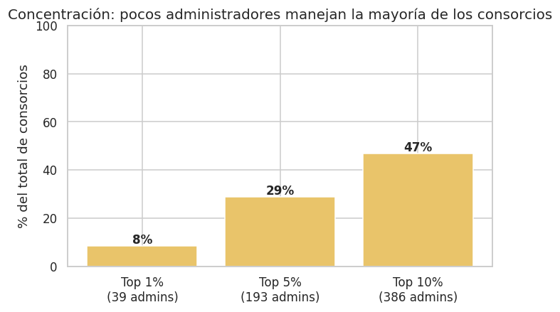
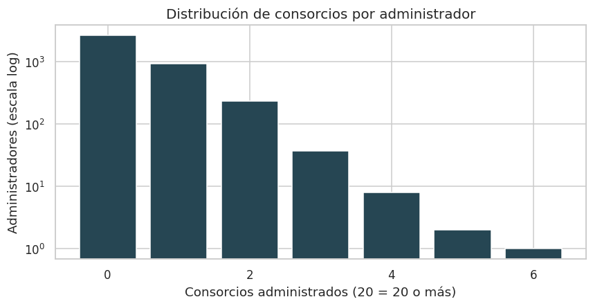
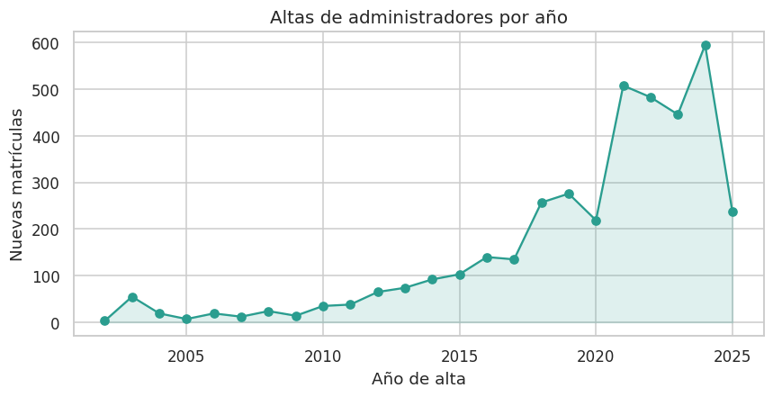
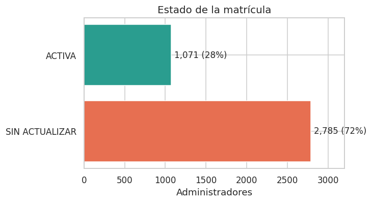
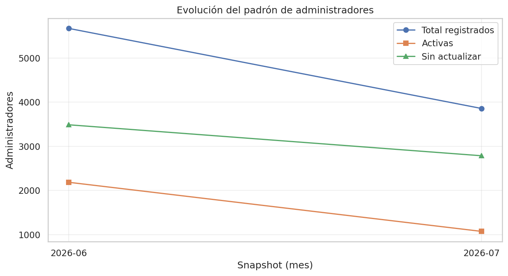

# 🏢 Administradores de Consorcios de CABA — Scraper & Análisis de datos

[](https://github.com/PabloAlaniz/Administradores-Consorcios/actions/workflows/ci.yml)


Scraper en **Python** del [buscador oficial de administradores de consorcios](https://buscador-admin-consorcio.buenosaires.gob.ar/administradores)
del Gobierno de la Ciudad de Buenos Aires, con un **análisis exploratorio** de los ~5.700 administradores registrados.

> **Stack:** Python · requests · BeautifulSoup · pandas · matplotlib · seaborn · pytest

---

## 📊 Análisis de datos

A partir de los datos públicos se construyó un dataset de **5.671 administradores únicos**
(corte de **junio 2026**). El análisis completo, reproducible y narrado está en
[`notebooks/analisis_administradores.ipynb`](notebooks/analisis_administradores.ipynb).

> ⚠️ **El padrón cambió después de este análisis.** En julio 2026 el buscador oficial pasó a
> devolver ~3.856 matrículas y cifras de consorcios muy distintas. El cambio quedó documentado,
> tal cual se observó, en la sección [Evolutivo](#-evolutivo-snapshots-mensuales).

Algunos hallazgos del corte de junio 2026:

### El mercado está muy concentrado



El **top 5% de los administradores (≈284 personas) maneja cerca del 67% de todos los consorcios**.
La mayoría administra 0 o 1, mientras que un puñado supera los **100 consorcios** a cargo.



### Boom de inscripciones desde 2018



Las altas se disparan a partir de **2018** (pico en 2018–2019) y se mantienen altas aún durante la pandemia.

### Padrón inflado y perfil de la actividad



Más del **60% de las matrículas están "sin actualizar"** y ~68% no administra ningún consorcio. Además:
~80% cobra honorarios, solo el **1,9% registra sanciones**, y la actividad está **equilibrada por género**
(estimado por prefijo de CUIT).

> 🔒 **Privacidad:** el análisis usa exclusivamente datos **agregados y anonimizados**
> (`data/agregados/`). El dataset crudo contiene datos personales (nombre, CUIT, domicilio) y **no se
> versiona ni se publica** — se genera localmente y se descarta. Ver [Privacidad y datos](#-privacidad-y-datos).

---

## 🚀 Quick Start

```bash
# 1. Clonar e instalar
git clone https://github.com/PabloAlaniz/Administradores-Consorcios.git
cd Administradores-Consorcios
python3 -m venv venv && source venv/bin/activate   # Windows: venv\Scripts\activate
pip install -r requirements.txt

# 2. Reproducir el análisis (sin scrapear: usa los agregados versionados)
jupyter notebook notebooks/analisis_administradores.ipynb
```

Para **regenerar la data desde cero**:

```bash
python administradores_scraper.py         # 1. scrapea  -> administradores.csv (local, gitignored)
python generar_agregados.py --snapshot    # 2. anonimiza -> data/agregados/ + snapshot del mes
python generar_evolutivo.py               # 3. consolida los snapshots -> data/evolutivo/
python generar_graficos_evolutivo.py      # 4. gráficos de tendencia -> docs/img/evolucion_*.png
```

---

## 🔁 Pipeline de datos

```
buscador GCBA
     │  administradores_scraper.py  (requests + BeautifulSoup + pandas)
     ▼
administradores.csv          ← crudo, con PII, LOCAL y gitignored
     │  generar_agregados.py --snapshot  (dedup por matrícula + anonimización)
     ▼
data/agregados/*.csv         ← foto ACTUAL sin PII, versionada
data/snapshots/YYYY-MM/      ← cortes mensuales fechados (agregados + panel pseudonimizado + metadata)
     │  generar_evolutivo.py  (consolida todos los cortes)
     ▼
data/evolutivo/*.csv + .md   ← series de tiempo, flujos, Gini/HHI y reporte mensual narrado
     │  generar_graficos_evolutivo.py / notebook  (matplotlib + seaborn)
     ▼
docs/img/*.png + insights    ← gráficos para el README
```

---

## 📈 Evolutivo: snapshots mensuales

El padrón cambia todos los meses (altas, bajas, matrículas que se actualizan, sanciones nuevas).
Para poder analizar esa **evolución en el tiempo**, cada corrida puede guardar un **snapshot fechado**:

```bash
python generar_agregados.py --snapshot           # snapshot del mes actual
python generar_agregados.py --snapshot 2026-07   # o con fecha explícita
python generar_evolutivo.py                      # reconstruye data/evolutivo/
python generar_graficos_evolutivo.py             # gráficos de tendencia en docs/img/
```

**Qué guarda cada snapshot** (`data/snapshots/YYYY-MM/`):

- Los agregados anonimizados de siempre, congelados a la fecha del corte, más un `metadata.json`
  con los totales.
- Dimensión **geográfica**: administradores por comuna (USIG) y por código postal del domicilio
  del administrador. La comuna todavía tiene poca cobertura en el padrón oficial; el CP cubre ~94%,
  y el evolutivo permite ver cómo mejora esa cobertura con el tiempo.
- `matriculas.csv`: un **panel pseudonimizado** (matrícula hasheada + estado + cantidad de
  consorcios + sanciones — todos atributos ya públicos en el buscador oficial; nunca nombre,
  CUIT ni domicilio). Es lo que permite calcular flujos reales entre meses.

**Qué produce el evolutivo** (`data/evolutivo/`):

- `resumen.csv` — un registro por snapshot con los KPIs principales (total de administradores,
  matrículas activas, concentración del top 1/5/10%, **índices de Gini y HHI**, sanciones…) y su
  **variación contra el mes anterior** (`var_*`). Gini y HHI se calculan desde la distribución
  agregada, así que funcionan retroactivamente para todos los snapshots.
- `flujos.csv` — movimientos **brutos** entre cortes consecutivos: altas y bajas del padrón,
  matrículas que se activaron o desactivaron, sancionados nuevos y administradores que ganaron
  o perdieron consorcios. Un +20 neto puede ser 25 altas y 5 bajas: esto lo hace visible.
- `evolucion_*.csv` — cada dimensión categórica (estado, tipo de persona, comuna, CP…) en formato
  largo (`snapshot, categoría, cantidad`), lista para graficar líneas de tendencia.
- `reporte_YYYY-MM.md` — **reporte narrado** del último corte con todas las variaciones,
  regenerado en cada corrida.

**Gráficos de tendencia**: `generar_graficos_evolutivo.py` produce `docs/img/evolucion_padron.png`
y `docs/img/evolucion_concentracion.png` a partir del resumen (con un solo snapshot son puntos;
las líneas aparecen a medida que se acumulan cortes).

### 🔍 El evolutivo en acción: el padrón cambió entre junio y julio 2026

El primer corte scrapeado en vivo (julio 2026) devolvió un padrón **muy** distinto al del análisis
original (junio 2026). Lejos de esconder la discrepancia, es exactamente el tipo de cambio que este
sistema existe para registrar — así que ambos cortes están versionados como snapshots y el salto
queda a la vista:

| Métrica | 2026-06 | 2026-07 | Δ |
|---|---:|---:|---:|
| Administradores registrados | 5.671 | 3.856 | **−1.815** |
| Consorcios administrados | 7.744 | 1.560 | **−6.184** |
| Matrículas activas | 2.184 | 1.071 | −1.113 |
| Máx. consorcios por administrador | 100+ | 6 | — |
| Top 5% concentra | 67,4% | 28,8% | −38,6 pp |



**Qué puede haber pasado** (no es determinable solo desde los datos):

1. **Depuración del padrón**: el GCBA dio de baja matrículas no renovadas — consistente con que
   la obligación de renovación anual figura en los propios mensajes del buscador.
2. **Cambio en el endpoint**: la respuesta pasó de pares *(administrador, consorcio)* a una fila
   por administrador, y `CANTIDADCONSORCIOS` puede haber cambiado de semántica (p. ej. solo
   consorcios con declaración vigente).

Probablemente sea una combinación de ambas. La política del repo es **documentar lo observado tal
cual**: cada snapshot lleva su `nota` metodológica en `metadata.json`, que se propaga
automáticamente al reporte mensual ([`reporte_2026-07.md`](data/evolutivo/reporte_2026-07.md)).
Los próximos cortes mensuales van a mostrar si los números se estabilizan en el nuevo nivel
(depuración) o siguen moviéndose (cambio de semántica).

La captura mensual está automatizada con **GitHub Actions**
([`.github/workflows/snapshot-mensual.yml`](.github/workflows/snapshot-mensual.yml)): el día 1 de
cada mes scrapea el padrón, genera el snapshot y commitea solo los agregados sin PII (el CSV crudo
vive únicamente en el runner efímero y se descarta). También se puede disparar a mano desde la
pestaña *Actions* (`workflow_dispatch`).

---

## 🛠️ Estructura del proyecto

```
Administradores-Consorcios/
├── administradores_scraper.py   # Scraper modular (recomendado)
├── main.py                      # Versión monolítica original (legacy)
├── generar_agregados.py         # Anonimiza y agrega el CSV crudo (--snapshot para corte mensual)
├── generar_evolutivo.py         # Series de tiempo, flujos, Gini/HHI y reporte mensual
├── generar_graficos_evolutivo.py # Gráficos de tendencia desde el evolutivo
├── notebooks/
│   └── analisis_administradores.ipynb
├── data/
│   ├── agregados/               # Foto actual (sin PII, versionada)
│   ├── snapshots/YYYY-MM/       # Cortes mensuales fechados
│   └── evolutivo/               # Series de tiempo consolidadas
├── docs/img/                    # Gráficos generados por el notebook
├── tests/                       # Tests unitarios (pytest)
├── .github/workflows/ci.yml     # CI: ruff + pytest
├── requirements.txt
├── LICENSE
└── README.md
```

### Cómo funciona el scraper

El buscador del GCBA usa protección CSRF y responde vía un endpoint AJAX que devuelve JSON.
El flujo (`administradores_scraper.py`):

```python
csrf_token = get_csrf_token(url)              # 1. token CSRF del <meta> del HTML
data       = build_post_data(csrf_token)      # 2. payload de búsqueda
headers    = build_headers()                  # 3. headers que emulan un navegador
json_data  = fetch_administradores_data(...)  # 4. POST al endpoint
df         = process_data_to_dataframe(...)   # 5. JSON -> DataFrame (pd.json_normalize)
save_to_csv(df)                               # 6. export a CSV UTF-8
```

Cada fila del endpoint es un par *(administrador, consorcio)*, por lo que una matrícula aparece
repetida; `generar_agregados.py` deduplica por `MATRICULAID`.

---

## 🧪 Testing & CI

```bash
pytest                              # corre los tests
pytest --cov=. --cov-report=html    # con coverage
```

El repo tiene **CI en GitHub Actions** (`.github/workflows/ci.yml`) que ejecuta linting con `ruff` y la
suite de `pytest` en cada push.

---

## 🔒 Privacidad y datos

- La fuente es un **portal público** del GCBA; aun así, el dataset crudo compila datos personales
  (nombre, CUIT, domicilio) de miles de personas.
- Por respeto a la privacidad (y a la Ley 25.326 de Protección de Datos Personales), **este repo no
  publica el dataset crudo**: está excluido por `.gitignore` y purgado del historial de git.
- Solo se versionan **agregados estadísticos anonimizados** (`data/agregados/`), de los que es imposible
  reconstruir individuos.
- Campos de contacto (teléfono, email) y documento **no son expuestos por el endpoint público**, por lo
  que no forman parte del análisis.

**Uso educativo y de análisis de datos públicos.** No hacer scraping masivo que afecte el servicio del GCBA.

---

## 📄 Licencia

[MIT](LICENSE) © 2026 Pablo Alaniz

---

**Hecho por [@PabloAlaniz](https://github.com/PabloAlaniz)**
